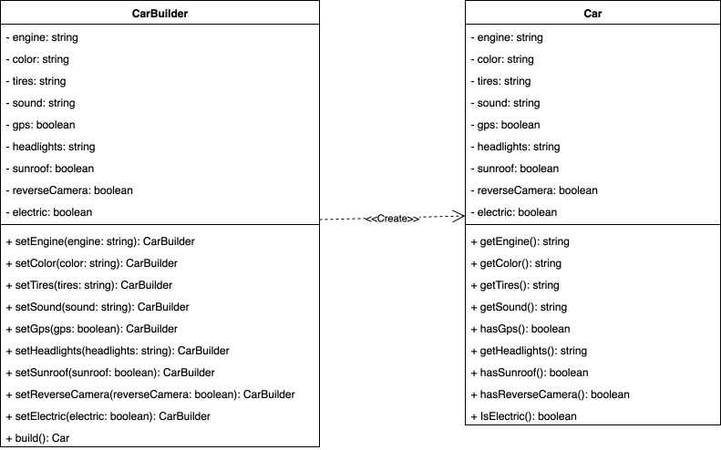

## Identificación

Tipo de patrón: Creacional

Patrón: Builder

## Justificación

En este caso de aplica el patrón builder porque este sirve para construir objetos complejos paso a paso, en donde se puede notar un código más legible, flexible y mantenible. Cada configuración opcional del automóvil puede irse agregando de forma fluida en la construcción, sin necesidad de crear grandes cantidades de metodos constructores.

## Diagrama de clases

