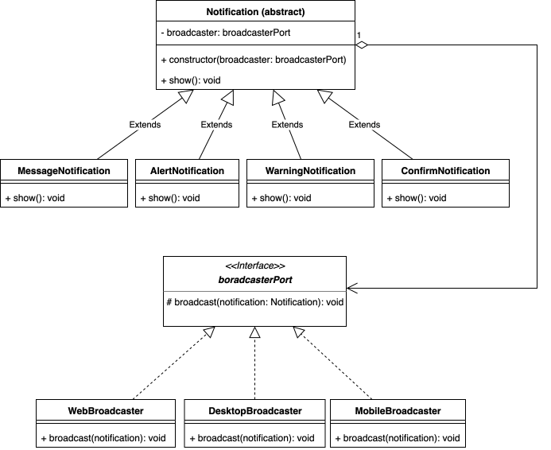

## Identificación

Tipo de patrón: Estructural

Patrón: Bridge

## Justificación

En este caso se aplica el patron bridge ya que este permite separar el tipo de notificacion (abstracción) de la forma de mostrarla
en cada plataforma (implementación)

- Si necesito agregar un nuevo tipo de notificación, solo creo una nueva subclase de Notification.
- Si necesito soportar una nueva plataforma, solo agrego un nuevo Broadcaster.
- No tengo que modificar lo que ya existe ni crear combinaciones innecesarias.

A la final lo que se logra con el patron bridge es evitar la explosión de subclases y poder evolucionar cada jerarquía de manera independiente (tipos y plataformas).

## Diagrama de clases

