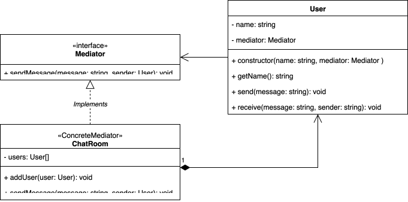

## Identificación

Tipo de patrón: Comportamiento

Patrón: Mediator

## Justificación

- Centraliza la comunicación entre los usuarios
- Los usuarios no se comunican directamente, sino a través de un ChatRoom
- Permite agregar/eliminar usuarios sin modificar la lógica de cada uno.

A la final se usa el patron mediador porque evita un acoplamiento fuerte entre los usuarios, organiza mejor la comunicación y mejora la mantenibilidad del sistema.

## Diagrama de clases

